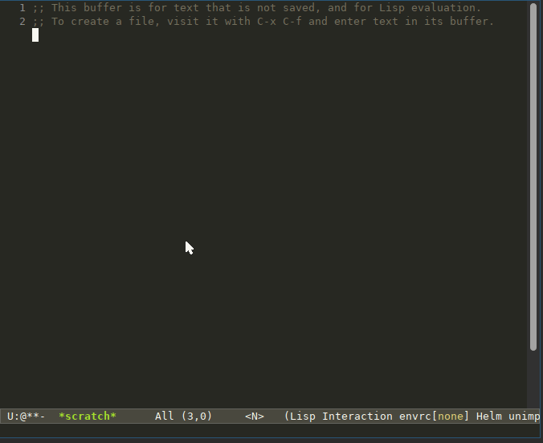
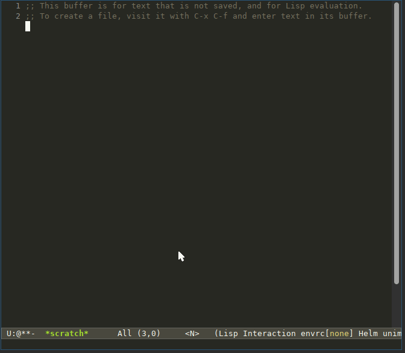

# H.el  [](https://github.com/NinjaTrappeur/h.el/actions/workflows/test.yml)

This Emacs plugin is all about helping you to keep your git repositories organized in a single unified tree.

The general idea is to organize the repositories by reflecting their remote clone URLs.

IE., having a directory structure like that:

```
~/code-root
├── codeberg.org
│   └── Freeyourgadget
│       └── Gadgetbridge
└── github.com
    ├── BaseAdresseNationale
    │   └── fantoir
    ├── mpv-player
    │   └── mpv
    └── NinjaTrappeur
        ├── cinny
        └── h.el
```

This Emacs plugin aims to help you navigate this repository tree **and** clone new repositories at the right place in the tree.

## Show me What You've Got

As always, a small demo is worth a thousand words!

**Jump to a local repository you already cloned:**


**Find a repository in a remote forge, clone it, and jump to it:**



**Alternatively, you can also specify a absolute git URL you want to clone:**



This plugin is heavily inspired by [**Zimbatm's h**](https://github.com/zimbatm/h).

## Quick Start

The minimal configuration consists in setting the directory in which you want to clone all your git repositories via the `h-code-root` variable.

Let's say you'd like to store all your git repositories in the `~/code-root` directory. You'll want to add the following snippet in your Emacs configuration file:

```elisp
(require 'h)
(setq h-code-root "~/code-root")
```

You can then call the `M-x h-jump-to-project` command to open a project living in your `~/code-root` directory **or** clone a new project in your code root.

Binding this command to a global key binding might make things a bit more convenient. I personally like to bind it to `M-h`. You can add the following snippet to your Emacs configuration to set up this key binding:

```elisp
(global-set-key (kbd "M-h") 'h-jump-to-project)
```

## Customization

### h-code-root - REQUIRED

Path to the directory containing all your projects. `h.el` organize the git repos you'll clone in a tree fashion.

All the code fetched using `h.el` will end up in this root directory. A tree of subdirectories will be created mirroring the remote clone URL.

For instance, after checking out https://git.savannah.gnu.org/git/emacs/org-mode.git, the source code will live in the h-code-root/git.savannah.gnu.org/git/emacs/org-mode/ local directory

### h-git-bin

Path pointing to the git binary. By default, it'll look for git in the current `$PATH`.

### h-forge-fetchers

Alist in the form of `("FORGE NAME" . FETCH-FUNCTION)` where `FETCH-FUNCTION` is a function in charge of retrieving a potential remote clone URL. More about this function in the [Fetchers](#fetchers) section.

## Fetchers

When a repository cannot be found in the code root directory, `h.el` will try to download it from different forges. By default, it'll try to find it on github.com, gitlab.com, git.sr.ht, and codeberg.org.

### Re-Using the Default Fetchers for your own Forge Instance

H.el provides some generic fetchers for Gitlab, Sourcehut, and Gitea.

You can re-use these generic fetchers for your own forge instance using the following functions:

- GitLab: `h--query-gitlab-owner-repo`
- SourceHut: `h--query-sourcehut-owner-repo`
- Gitea: `h--query-gitea-owner-repo`

These functions share the same 4 input arguments:

- `instance-url`: your instance [FQDN](https://fr.wikipedia.org/wiki/Fully_qualified_domain_name). For instance: `gitlab.gnome.org`, `git.alternativebit.fr`, …
- `user-name`: the user name for which we want to clone the repository.
- `repo-name`: name of the repository we want to clone.
- `callback`: function `h.el` will use to clone the repository once we retrieved the various clone URLs. The callback takes an alist as parameter. The alist being of the form of : `((ssh . SSH-CHECKOUT-URL) (https . HTTPS-CHECKOUT-URL))`.

You can re-use these functions by instantiating them for a specific forge, then by appending this instantiation to the `h-forge-fetchers` variable in your Emacs configuration.

Let's say you want to retrieve repositories from the Gnome Gitlab instance living at `gitlab.gnome.org`. You'll have to add the following snippet to your Emacs configuration:

```elisp
(setq h-forge-fetchers
      `(("gitlab.gnome.org" (lambda (owner repo cb)(h--query-gitlab-owner-repo "gitlab.gnome.org" owner repo cb)))
        ,h-forge-fetchers))
```

### Writing your Forge Fetcher from Scratch

You may also want to support a forge for which `h.el` currently does not provide any generic fetcher. In that case, you'll have to write a function in the form of:

```elisp
(defun your-custom-fetcher (owner repo)
; (..) the actual implementation
)
```

The function needs to accept two input parameters:

- `owner`: string containing the name of the owner of the query repository. IE. `ninjatrappeur` for the `ninjatrappeur/h.el` query.
- `repository`: string containing the name of the query repository. IE. `h.el` for the `ninjatrappeur/h.el` query.

This function will return either `nil` in case the query couldn't be found on the remote forge. An alist containing the SSH and HTTPS clone URLs in the form of:

```elisp
'((ssh . SSH-CHECKOUT-URL)
  (https . HTTPS-CHECKOUT-URL))
```
